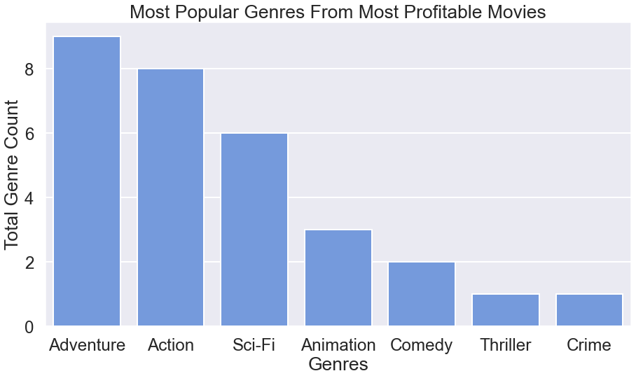
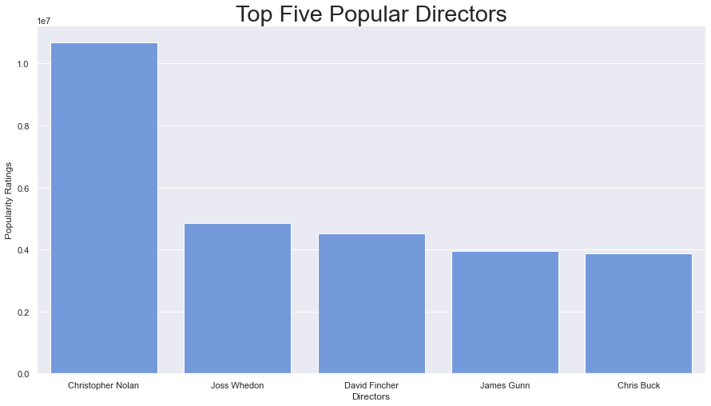
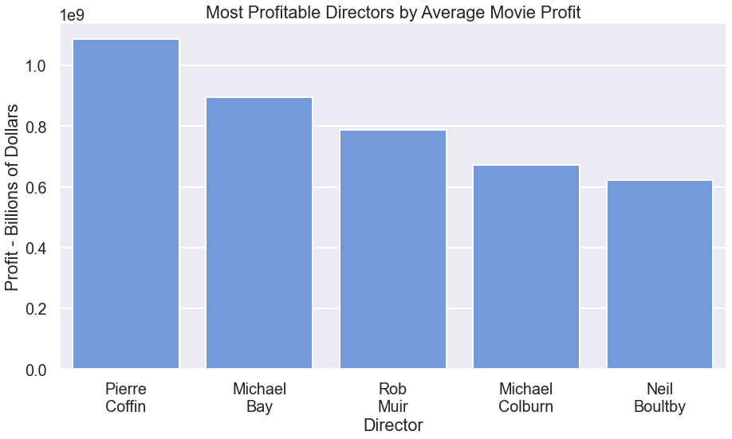
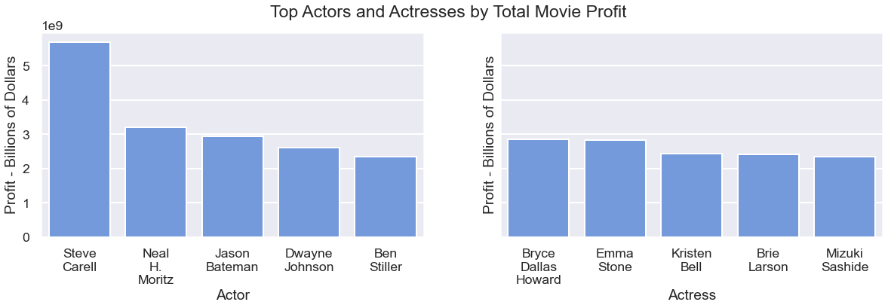
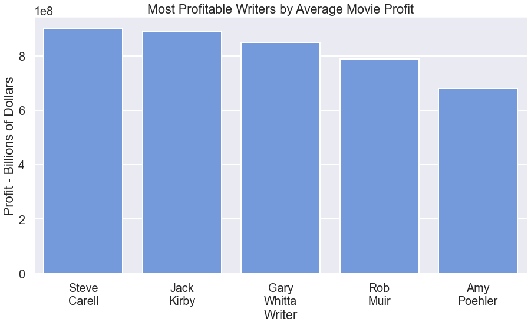

# Microsoft Film Production: Data Analysis & Strategy Recommendations

**Authors**: Alex Valencia, Warren Umbach, Jordan Johnson

## Overview

This project analyzes the question "What makes a successful movie?" for Microsoft, which is making a movie studio but not well-versed in the filming industry. With our analysis, we found the best people to hire to make a movie based on how popular they are and how much money their movies make. We outline the best decisions to make to maximize profits and movie ratings.

## Business Problem

Microsoft is deciding how to make a movie. Part of the process is figuring out who to hire and when to release the movie. We used available movie data to find the best people to hire based on profits and what kind of movie is the most popular.

We can provide some good options to choose from for a few different categories. These categories are:

* Genres of movie to make
* Directors, actors, and actresses to hire based on ratings 
* Directors, writers, actors, actresses, and movie release month based on profitability

## Data

We used data from Box Office Mojo, IMDB, Rotten Tomatoes, TheMovieDB.org and, the-numbers.com. This data contains information that:

* Describes how popular movies are
* The people who worked on the movies
* Their professions
* Movie genre
* Release date
* Monetary info like budget and gross sales.

### Process
The areas to look at are profitable writers, directors, actors, and actresses, and the best month to release a certain genre. We started by reading in all of the available data from the following files:

- **Name.basics** - this data frame contains a few pertinent columns. They are nconst, primary_name, and primary_profession. Nconst is a name id column that we used when merging to other data frames. Primary_name is the name of the person represented in a row. Primary_profession is a comma-separated string of all jobs that the primary_name person had for a movie. 
- **Title.basics** - we used two columns from this data frame. The first was tconst which is a movie title id column. This column exists in the rest of the data frames below and it is the column we used to merge them all. The second column that we used was the genre of the movie. Each entry contains a comma-separated string of genres similar to the primary_profession column that will need to be separated.
- **Title.crew** - this has the title id column, tconst, and columns for each director and writer. We will use both of these columns to figure out which directors and writers working on the most profitable movies.
- **Tn.movie_budgets** - this data frame contains important budget and movie-grossing information. We will use the movie column to merge the data. We will also use production_budget, domestic_gross, and worldwide_gross. The production budget is how much money was spent making the movie. The gross columns are how much money the movie made. We will use these last three columns to calculate the profit that movies made. Also, these columns will need to be cleaned because they contain dollar signs and commas.


## Methods

First, we combined existing data into one dataframe and then we dropped some columns that we didn’t need.
Next, we cleaned the data by reformatting some columns like the budget and gross columns to remove commas, dollar signs, and other delimiters.
Finally, we each made our own barplots to visualize the data.

After looking at all available data, we merged them into one data frame we called tcombo. We needed to rename a primary_title column to ‘movie’ so that we could use it to merge the title.name data frame. Next, we dropped unnecessary columns from the merged data frame. We used outer merges so we had a lot of extra rows with missing data. We did this so that we could have more control over which data we wanted to drop. We solved this by dropping rows in only a subset of columns. This subset does not contain the budget production and grossing columns. It is fine if either domestic or worldwide gross is missing, but not both and we took care of that next. Then, we dropped all rows where the budget was missing or zero. We did not want to include movies without a budget because that would throw off the profit. Next, we made the budget and gross columns into float data types so that we could use them to make a profit column. We started by removing commas and dollar signs and finished by casting them as floats. Last, we made a profit column that was the difference between the worldwide gross and production budget.

The next problem was that the profession and genre columns contained comma-separated lists. We needed to put each genre and profession onto its row. We started by splitting each entry into commas. This turned them into list types. Next, we used the explode method and passed each column. This moved each list entry to its row and copied the rest of the columns down to it. Now we could find all rows where genre or profession is a specified value. 

We wanted to compare different genres and professions to the profit those movies made. We made new data frames that included only directors, writers, and actors, and actresses. Then, we could find the median profit of each movie that each person participated in.


## Results

We would suggest picking a genre of movie to make based on what is popular. 
Then, pick from a list of directors, actors, and actresses who are both popular and profitable.
Next, pick some writers who are profitable.
Finally, pick a release date based on the genre.

### Visual 1


### Visual 2


### Visual 3


### Visual 4


### Visual 5


## Conclusions

We recommend: 
* Focus on Adventure and Action genres. 
* The top five actors are Steve Carell, Neal H, Moritz, Jason Bateman, Dwayne Johnson, and Ben Stiller. The top five actresses are Bryce Dallas Howard, Emma Stone, Kristen Bell, Brie Larson, and Mizuki Sashide.
* The top five directors are Pierre Coffin, Michael Bay, Rob Muir, Michael Colburn, and Neil Boultby. Choosing any of these would be a good idea.
* The top five writers by average movie profit are Steve Carell, Jack Kirby, Gary Whitta, Rob Muir, and Amy Poehler. 
* Release the movie at the beginning of June.

We plotted the most profitable genres by the month that they were released. In general, Adventure and Action do well any time, but it is best to release in June. We suspect that more people can go see movies during the summer so releasing at the beginning is a good move. Additionally, Thriller and Drama movies do well in October for Halloween. Romance movies make an appearance in the top five in February because of Valentine's day, but Action and Adventure are always a safe bet.

## For More Information

Please review our full analysis in [our Jupyter Notebook](./microsoft_movie_analysis_final.ipynb) or our [presentation](./DS_Project_Presentation.pdf).

For any additional questions, please contact **Alex Valencia - asvalencia1688@gmail.com, Jordan Johnson - johnsonjordan556677@gmail.com, Warren Umbach - umbach4@gmail.com**

## Repository Structure

Describe the structure of your repository and its contents, for example:

```
├── README.md                           <- The top-level README for reviewers of this project
├── microsoft_movie_analysis_final.ipynb   <- Narrative documentation of analysis in Jupyter notebook
├── DS_Project_Presentation.pdf         <- PDF version of project presentation
├── data                                <- Both sourced externally and generated from code
└── images                              <- Both sourced externally and generated from code